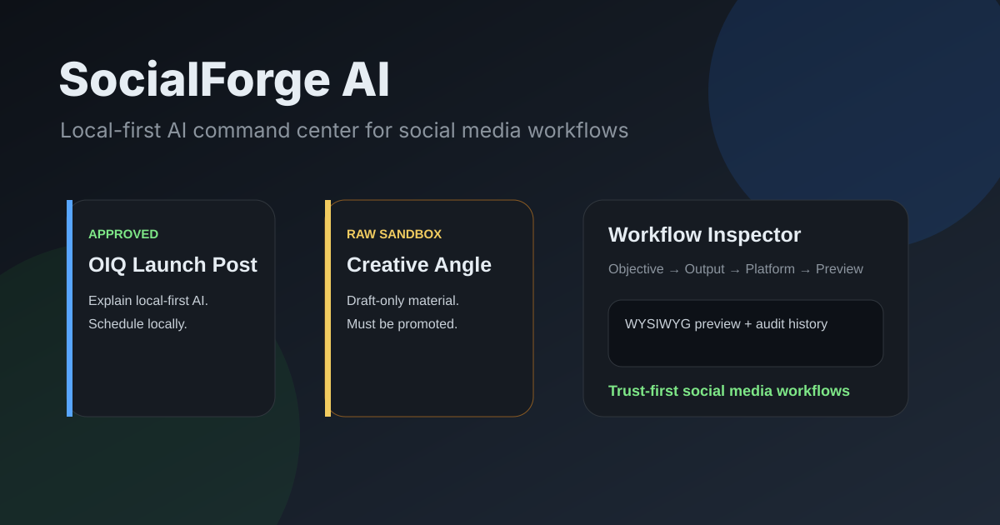

# socialforge-ai

<p align="center">
  
</p>

<p align="center">
  
</p>

<h3 align="center">Draft first. Review always. Post never by accident.</h3>

<p align="center">A local-first AI command center for social media planning, drafting, review, and scheduling.</p>

<p align="center">
  <a href="https://lumenhelixlab.github.io/socialforge-ai/">Launch Page</a>
  <span> · </span>
  <a href="https://github.com/lumenhelixlab/socialforge-ai">GitHub</a>
  <span> · </span>
  <a href="https://lumenhelix.com">LumenHelix</a>
</p>

---

SocialForge AI is a local-first command center for social media planning, content generation, review, and scheduling. It uses a structured task setup, draft-first workflow, visual job board, calendar, and inspector so creators and teams know what the AI is doing, what platform it is for, and whether it is approved and scheduled before any content goes live.

## Why socialforge-ai

- **Trust the workflow.** Every task moves through visible states: idea, drafting, review, approval, scheduling.
- **Own your content.** Projects, drafts, and audit records stay in a local SQLite database.
- **Use any model.** Ollama integration with local fallback keeps you productive offline.

## Quick start

### macOS / Linux

```bash
git clone https://github.com/lumenhelixlab/socialforge-ai.git
cd socialforge-ai
git clone https://github.com/LumenHelixLab/socialforge-ai.git
cd socialforge-ai
# Terminal 1: backend
cd backend && python3 -m venv .venv && .venv/bin/pip install -r requirements.txt && .venv/bin/uvicorn main:app --reload --port 8787
# Terminal 2: frontend
cd frontend && npm install && npm run dev
```

### Windows (PowerShell)

```powershell
git clone https://github.com/lumenhelixlab/socialforge-ai.git
Set-Location socialforge-ai
git clone https://github.com/LumenHelixLab/socialforge-ai.git
Set-Location socialforge-ai
# Terminal 1: backend
cd backend; python -m venv .venv; .venv\Scripts\pip install -r requirements.txt; .venv\Scripts\uvicorn main:app --reload --port 8787
# Terminal 2: frontend
cd frontend; npm install; npm run dev
```

### Windows (Git Bash / WSL)

```bash
git clone https://github.com/lumenhelixlab/socialforge-ai.git
cd socialforge-ai
git clone https://github.com/LumenHelixLab/socialforge-ai.git
cd socialforge-ai
# Terminal 1: backend
cd backend && python3 -m venv .venv && .venv/bin/pip install -r requirements.txt && .venv/bin/uvicorn main:app --reload --port 8787
# Terminal 2: frontend
cd frontend && npm install && npm run dev
```

> Tested on Windows 11, macOS Sonoma, Ubuntu 22.04/24.04, and modern mobile browsers.

## Features

| Feature | What it gives you |
|---------|-------------------|
| Structured task setup | Objective, output type, platform, constraints, model lane, and execution plan keep AI work repeatable. |
| Draft-first workflow | Generate variants, review, edit, approve, and schedule — no live posting without explicit approval. |
| Visual work board | Move tasks through idea, drafting, review, approval, and scheduling with drag-and-drop cards. |
| Local model support | Optional Ollama integration with local fallback so the app works even when no model server is running. |

## Architecture

```
Creator  ->  React/Vite Frontend  ->  FastAPI Backend  ->  SQLite + Local Model Adapter
             |                                                              |
             └────────── Drag-and-drop job board + calendar + inspector ────┘
```

## Development

```bash
# Backend
cd backend && .venv/bin/uvicorn main:app --reload --port 8787

# Frontend (new terminal)
cd frontend && npm run dev
```

## Roadmap

- [ ] Rich WYSIWYG editor and saved brand/platform presets
- [ ] Full calendar integration and scheduler authority
- [ ] Controlled publisher architecture with audit logs

## License

Released under the MIT License.

---

<p align="center">
  <sub>socialforge-ai is a <a href="https://lumenhelix.com">LumenHelix</a> project — Applied Symbolic Dynamics & Reversible Computation.</sub>
</p>
