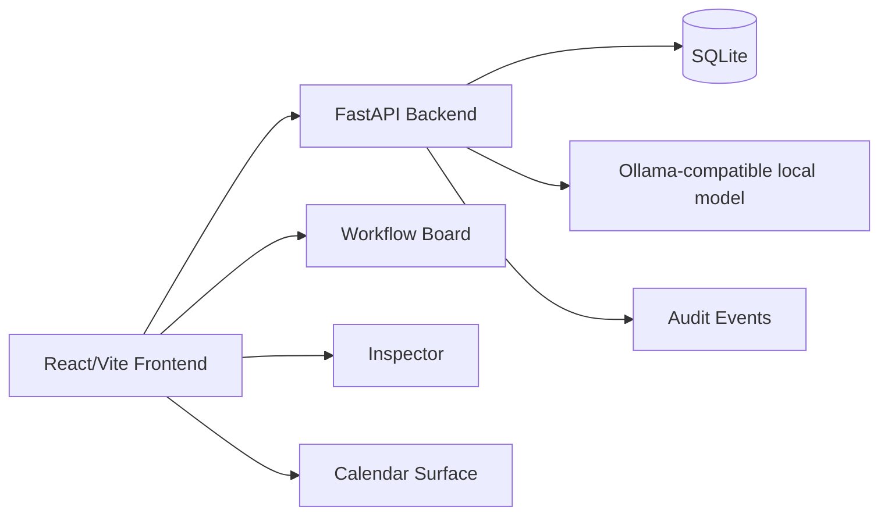
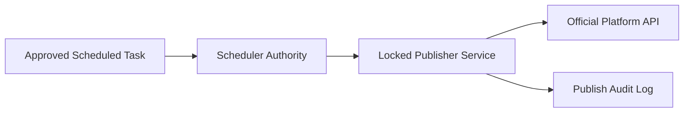

# Architecture

## Overview

SocialForge AI is a local-first AI social media workflow app.



## Core layers

| Layer | Role |
|---|---|
| Frontend | User interaction, workflow board, preview editor, calendar surface |
| Backend | API, persistence, validation, local model calls |
| SQLite | Local task/workflow storage |
| Ollama-compatible client | Optional local generation |
| Audit events | Local trust/history record |

## Product model

```txt
Command Center  = overview and system health
Workflow Board  = state and movement
Calendar        = time and scheduling
Task Setup      = structured AI programming method
Inspector       = details, preview, approval, history
AI Engine       = generation/review/polish
Scheduler       = future execution authority
Audit Log       = trust memory
```

## Future publisher architecture

Publishing must remain separate from AI generation.



No AI agent should directly hold platform credentials.
